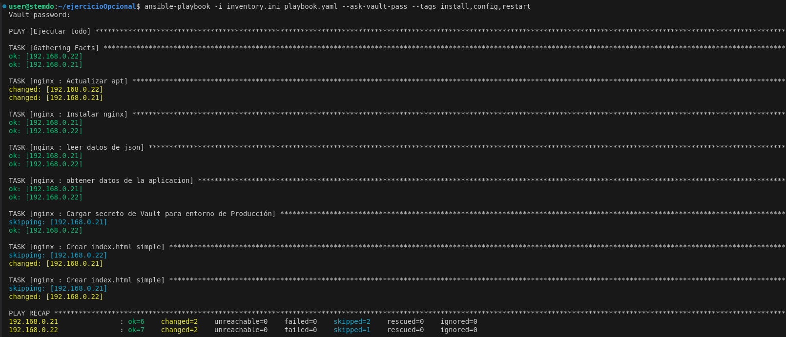
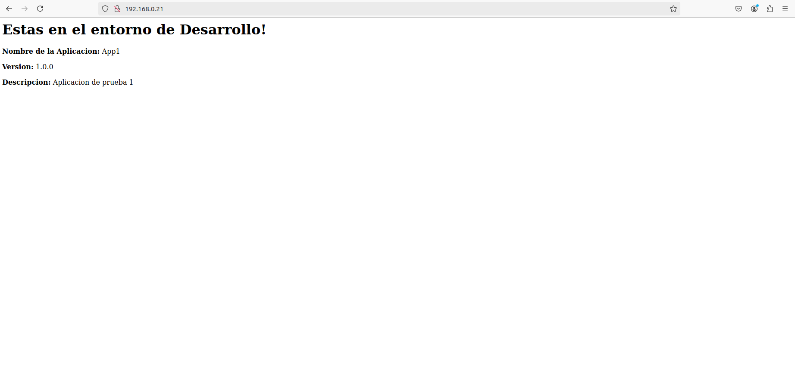
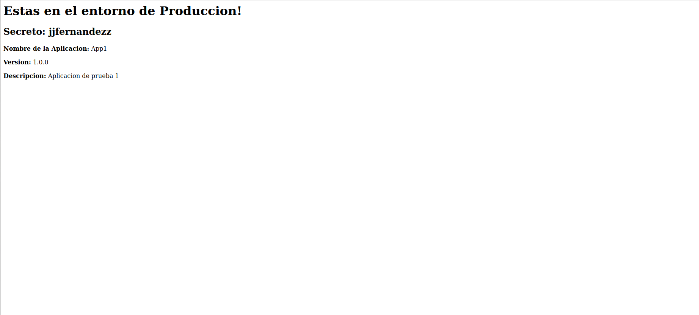

# Solucion Ejercicio Opcional

## Descripcion
- Todos los codigos e ficheros estan en la carpeta `ficheros-solucion`

1) Primero se ha creado un rol llamando `nginx`, y la plantilla la he generado con el siguiente comando:
`ansible-galaxy init nginx`.

2) Posteriormente se ha creado el fichero del inventario `inventory.ini` con algunas variable dentro, tanto la de entorno como la del fichero json:
```ini
[dev]
192.168.0.21 entorno="Desarrollo" fichero="application.json" 

[prod]
192.168.0.22 entorno="Produccion" fichero="application.json" 
```

3) Se crea el fichero `application.json`.

4) Se crea tambien el `playbook.yaml` donde se importaria el rol de nginx y se ejecuten sus tasks.
```yaml
---
- name: Ejecutar todo
  hosts: all
  become: true
  
  tasks:
    - name: Lanzar el rol de nginx 
      import_role:
        name: nginx
```

5) Creamos tambien el fichero del secreto en  produccion con ansible-vault mediante el siguiente comando:
`ansible-vault create secreto.yaml` donde la contraseña establecida es: `joelito`, luego dentro del fichero esta el siguiente secreto a mostrar:
```yaml
secreto1: "jjfernandezz"
```

6) Dentro del rol de nginx las task que se utilizan para que se; actualize los paquetes, instale nginx, lea los datos del fichero json, extraiga la informacion deseada, carge el secreto de vault pero con las condiciones de produccion, se crea el index.html dinamico, dependiendo del entorno hace una cosa u otra y finalmente se reinicia nginx. Se hace uso de las siguientes etiquetas: install, config, restart.

```yaml
---
- name: Actualizar apt
  apt:
    update_cache: yes
  tags:
    - install

- name: Instalar nginx
  apt:
    name: nginx
    state: present
  tags:
    - install

- name: leer datos de json
  set_fact:
    app_info: "{{lookup('file', fichero) | from_json}}"
  tags:
    - config

- name: obtener datos de la aplicacion
  set_fact:
    app_name: "{{ app_info.applications[0].name }}"
    app_version: "{{ app_info.applications[0].version }}"
    app_description: "{{ app_info.applications[0].description }}"
  tags:
    - config

- name: Cargar secreto de Vault para entorno de Producción
  include_vars: secreto.yaml
  when: entorno == "Produccion"
  tags:
    - config

- name: Crear index.html simple
  copy:
    content: "<html><body><h1>Estas en el entorno de {{ entorno }}!</h1><p><strong>Nombre de la Aplicacion:</strong> {{ app_name }}</p><p><strong>Version:</strong> {{ app_version }}</p><p><strong>Descripcion:</strong> {{ app_description }}</p></body></html>"
    dest: /var/www/html/index.html
  when: entorno == "Desarrollo"
  tags:
    - config

- name: Crear index.html simple
  copy:
    content: "<html><body><h1>Estas en el entorno de {{ entorno }}!</h1><h2>{{ secreto1 }}</h2><p><strong>Nombre de la Aplicacion:</strong> {{ app_name }}</p><p><strong>Version:</strong> {{ app_version }}</p><p><strong>Descripcion:</strong> {{ app_description }}</p></body></html>"
    dest: /var/www/html/index.html
  when: entorno == "Produccion"
  tags:
    - config

- name: Reiniciar nginx
  service: 
    name: nginx
    state: restarted
  tags: 
    - Restart
```

7) Finalmente se ejecuta el playbook general con el siguiente comando:
`ansible-playbook -i inventory.ini playbook.yaml --ask-vault-pass --tags install,config,restart`

Ponemos la contraseña: `joelito`



8) Se ven los resultados de la siguiente manera:



